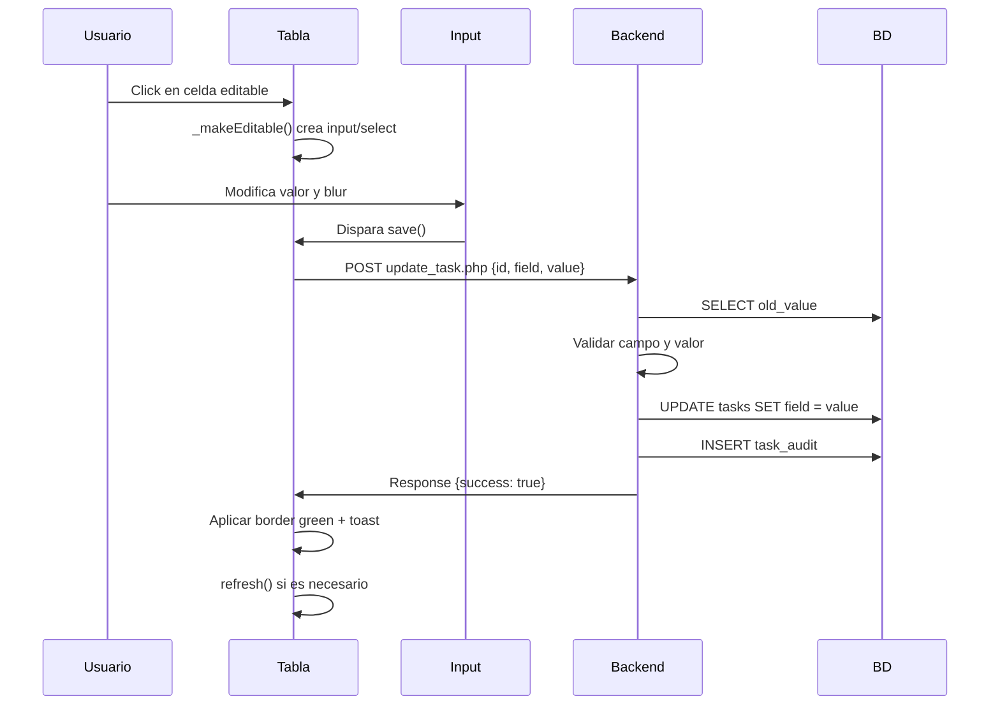

# Backend API - Processes & Tasks Module

## 📁 Estructura de Archivos

```
/modules/processes_tasks/includes/
├── get_tasks.php           # Obtener tareas con paginación, búsqueda, filtros
├── update_task.php         # Actualizar campo individual de tarea
├── business.php            # Catálogo de negocios
├── users.php               # Catálogo de usuarios
├── projects.php            # Catálogo de proyectos
├── log_task_audit.php      # Helper para auditoría
└── migrate_tasks_table.sql # Script de migración de BD
```

---

## 🚀 Instalación

### 1. Ejecutar Migración SQL

```bash
# Conectar a MySQL
mysql -u usuario -p nombre_base_datos

# Ejecutar script
source /ruta/a/migrate_tasks_table.sql;
```

O desde phpMyAdmin:
1. Seleccionar base de datos
2. Ir a pestaña "SQL"
3. Copiar contenido de `migrate_tasks_table.sql`
4. Ejecutar

### 2. Verificar Configuración de BD

Asegúrate que `/config/config.php` contiene conexión PDO válida:

```php
<?php
// config/config.php
try {
    $pdo = new PDO(
        'mysql:host=localhost;dbname=tu_base_datos;charset=utf8mb4',
        'tu_usuario',
        'tu_password',
        [
            PDO::ATTR_ERRMODE => PDO::ERRMODE_EXCEPTION,
            PDO::ATTR_DEFAULT_FETCH_MODE => PDO::FETCH_ASSOC,
            PDO::ATTR_EMULATE_PREPARES => false
        ]
    );
} catch (PDOException $e) {
    die('Error de conexión: ' . $e->getMessage());
}
```

### 3. Verificar Permisos

```bash
chmod 755 /modules/processes_tasks/includes/*.php
```

---

## 📡 Endpoints

### GET `/includes/get_tasks.php`

Obtiene lista de tareas con paginación, búsqueda, filtros y ordenamiento.

**Parámetros Query:**
- `page` (int, default: 1) - Número de página
- `pageSize` (int, default: 25, max: 100) - Registros por página
- `search` (string) - Búsqueda en folio, titulo, descripcion
- `tipo` (string) - Filtro por tipo: Tarea, Proceso, Tarea de proceso
- `unidad` (string) - Filtro por unidad: Comercial, Operaciones, RRHH, Finanzas
- `status` (string) - Filtro por status: En tiempo, En proceso, Terminada, Vencida, Auditada
- `sortBy` (string) - Campo para ordenar: id, folio, titulo, fecha_inicio, etc.
- `sortDir` (string) - Dirección: asc o desc

**Ejemplo Request:**
```javascript
fetch('/modules/processes_tasks/includes/get_tasks.php?page=1&pageSize=25&search=dashboard&tipo=Tarea&sortBy=fecha_inicio&sortDir=desc')
```

**Response (200 OK):**
```json
{
  "success": true,
  "data": [
    {
      "id": 1,
      "folio": "T-00001",
      "unidad": "Comercial",
      "negocio": "Netflix",
      "titulo": "Implementar nuevo dashboard",
      "descripcion": "Dashboard con métricas...",
      "fecha_inicio": "2024-01-15",
      "fecha_fin": "2024-02-15",
      "archivos_count": 3,
      "creador": "Juan Pérez",
      "delegado": "Ana López",
      "nivel": "Importante",
      "tipo": "Tarea",
      "proyecto": "Proyecto Alpha",
      "ponderacion": 5,
      "status": "En proceso",
      "created_at": "2024-01-10 10:00:00",
      "updated_at": "2024-01-12 14:30:00"
    }
  ],
  "total": 150,
  "page": 1,
  "pageSize": 25,
  "totalPages": 6
}
```

---

### POST `/includes/update_task.php`

Actualiza un campo individual de una tarea con validación y auditoría.

**Headers:**
- `Content-Type: application/json`

**Body (JSON):**
```json
{
  "id": 1,
  "field": "status",
  "value": "Terminada"
}
```

**Campos Permitidos:**
- `unidad`, `negocio`, `titulo`, `descripcion`
- `fecha_inicio`, `fecha_fin`
- `creador`, `delegado`
- `nivel`, `tipo`, `proyecto`
- `ponderacion`, `status`

**Validaciones:**
- `titulo`: No vacío, máx 250 caracteres
- `descripcion`: Máx 1000 caracteres
- `fecha_inicio`, `fecha_fin`: Formato YYYY-MM-DD, fecha_fin >= fecha_inicio
- `ponderacion`: Entre 1 y 5
- `status`: Valor válido de enum

**Response (200 OK):**
```json
{
  "success": true,
  "message": "Campo actualizado correctamente",
  "data": {
    "id": 1,
    "field": "status",
    "old_value": "En proceso",
    "new_value": "Terminada",
    "updated_at": "2024-01-15 16:45:30"
  }
}
```

**Response (400 Bad Request):**
```json
{
  "success": false,
  "message": "La fecha de terminación debe ser posterior a la fecha de inicio"
}
```

**Response (401 Unauthorized):**
```json
{
  "success": false,
  "message": "No autenticado. Inicie sesión."
}
```

---

### GET `/includes/business.php`

Retorna lista de negocios únicos para selector.

**Parámetros Query:**
- `unidad` (string, opcional) - Filtra negocios por unidad

**Response:**
```json
[
  {"label": "Netflix", "value": "Netflix"},
  {"label": "Disney+", "value": "Disney+"},
  {"label": "HBO Max", "value": "HBO Max"}
]
```

---

### GET `/includes/users.php`

Retorna lista de usuarios activos para selectores de Creador y Delegado.

**Response:**
```json
[
  {"label": "Juan Pérez", "value": "Juan Pérez"},
  {"label": "María García", "value": "María García"},
  {"label": "Carlos López", "value": "Carlos López"}
]
```

---

### GET `/includes/projects.php`

Retorna lista de proyectos únicos para selector.

**Response:**
```json
[
  {"label": "Proyecto Alpha", "value": "Proyecto Alpha"},
  {"label": "Proyecto Beta", "value": "Proyecto Beta"},
  {"label": "Proyecto Gamma", "value": "Proyecto Gamma"}
]
```

---

## 🔒 Seguridad

### Autenticación
Todos los endpoints de escritura requieren sesión activa:
```php
session_start();
if (!isset($_SESSION['user_id'])) {
    http_response_code(401);
    exit;
}
```

### SQL Injection Prevention
Uso de prepared statements en todas las queries:
```php
$stmt = $pdo->prepare("UPDATE tasks SET titulo = ? WHERE id = ?");
$stmt->execute([$value, $taskId]);
```

### Field Whitelist
Solo se permiten campos específicos para actualización:
```php
$allowedFields = ['unidad', 'negocio', 'titulo', ...];
if (!in_array($field, $allowedFields)) {
    throw new Exception("Campo no permitido");
}
```

### Input Validation
Validaciones específicas por tipo de campo antes de UPDATE.

---

## 📊 Auditoría

Cada cambio se registra automáticamente en `task_audit`:

```sql
CREATE TABLE task_audit (
    id INT AUTO_INCREMENT PRIMARY KEY,
    task_id INT NOT NULL,
    field VARCHAR(50) NOT NULL,
    old_value TEXT,
    new_value TEXT,
    user_id INT,
    changed_at TIMESTAMP DEFAULT CURRENT_TIMESTAMP,
    FOREIGN KEY (task_id) REFERENCES tasks(id) ON DELETE CASCADE
);
```

**Función Helper:**
```php
logTaskAudit($pdo, $taskId, $field, $oldValue, $newValue, $userId);
```

**Ejemplo de registro:**
```sql
SELECT * FROM task_audit WHERE task_id = 1 ORDER BY changed_at DESC;
```

| id | task_id | field  | old_value  | new_value | user_id | changed_at          |
|----|---------|--------|------------|-----------|---------|---------------------|
| 15 | 1       | status | En proceso | Terminada | 5       | 2024-01-15 16:45:30 |
| 14 | 1       | titulo | Dashboard  | Nuevo...  | 5       | 2024-01-15 14:20:10 |

---

## 🧪 Testing

### Probar GET con cURL

```bash
# Obtener primera página
curl "http://localhost/modules/processes_tasks/includes/get_tasks.php?page=1&pageSize=10"

# Búsqueda
curl "http://localhost/modules/processes_tasks/includes/get_tasks.php?search=dashboard"

# Filtros combinados
curl "http://localhost/modules/processes_tasks/includes/get_tasks.php?tipo=Tarea&status=En%20proceso&sortBy=fecha_inicio&sortDir=desc"
```

### Probar POST con cURL

```bash
curl -X POST http://localhost/modules/processes_tasks/includes/update_task.php \
  -H "Content-Type: application/json" \
  -b "PHPSESSID=tu_session_id" \
  -d '{"id": 1, "field": "status", "value": "Terminada"}'
```

### Probar Catálogos

```bash
curl "http://localhost/modules/processes_tasks/includes/business.php"
curl "http://localhost/modules/processes_tasks/includes/users.php"
curl "http://localhost/modules/processes_tasks/includes/projects.php"
```

---

## 🐛 Troubleshooting

### Error: "Database connection failed"
- ✅ Verificar credenciales en `/config/config.php`
- ✅ Verificar que MySQL esté corriendo
- ✅ Verificar permisos del usuario de BD

### Error: "Table 'tasks' doesn't exist"
- ✅ Ejecutar `migrate_tasks_table.sql`
- ✅ Verificar nombre de base de datos

### Error: "No autenticado"
- ✅ Iniciar sesión en el sistema
- ✅ Verificar que `$_SESSION['user_id']` esté definido

### Error: "Campo no permitido"
- ✅ Verificar que el campo esté en `$allowedFields`
- ✅ Revisar typo en nombre del campo

### Datos no se actualizan
- ✅ Verificar respuesta JSON en Network tab del navegador
- ✅ Revisar logs de error PHP: `tail -f /var/log/php_errors.log`
- ✅ Verificar permisos de escritura en tabla `tasks`

---

## 📈 Performance

### Índices Optimizados

```sql
-- Ya incluidos en migrate_tasks_table.sql
INDEX idx_folio (folio)
INDEX idx_unidad (unidad)
INDEX idx_status (status)
INDEX idx_tipo (tipo)
INDEX idx_fecha_inicio (fecha_inicio)
INDEX idx_fecha_fin (fecha_fin)
```

### Cache de Catálogos
Los catálogos son cacheados en el frontend en `_catalogCache`:
- Se cargan una vez al inicializar la tabla
- No requieren llamadas repetidas al servidor
- Reducen latencia en edición de selects

---

## 🔄 Flujo de Actualización



---

## 📝 Notas de Implementación

1. **CORS**: Los headers CORS están permitidos para desarrollo. En producción, especifica dominios permitidos.

2. **Rate Limiting**: No implementado. Considera agregar throttling para prevenir abuso.

3. **Caché**: No hay caché de servidor. Considera Redis/Memcached para catálogos frecuentes.

4. **Validación**: Validaciones básicas implementadas. Agrega reglas de negocio específicas según necesidad.

5. **Soft Delete**: No implementado. Para delete, considera agregar campo `deleted_at` en lugar de DELETE real.

6. **File Upload**: `archivos_count` es solo contador. Implementar upload real requiere endpoint adicional.

---

## 🎯 Próximos Pasos

- [ ] Implementar endpoint para upload de archivos
- [ ] Crear endpoint para duplicar tareas (copy action)
- [ ] Crear endpoint para eliminar tareas (delete action)
- [ ] Agregar endpoint para historial de auditoría (audit modal)
- [ ] Implementar notificaciones push para cambios en tareas delegadas
- [ ] Agregar export a Excel (además de CSV)
- [ ] Implementar búsqueda avanzada con múltiples criterios
- [ ] Agregar bulk actions (selección múltiple)

---

**Última actualización:** Enero 2024  
**Versión:** 1.0.0  
**Autor:** Sistema Indice ERP
